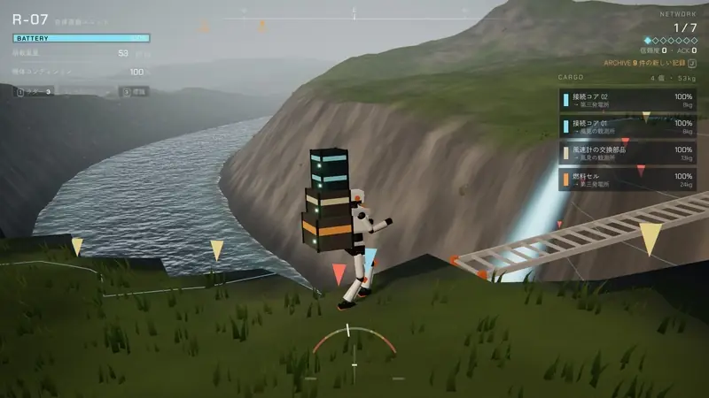
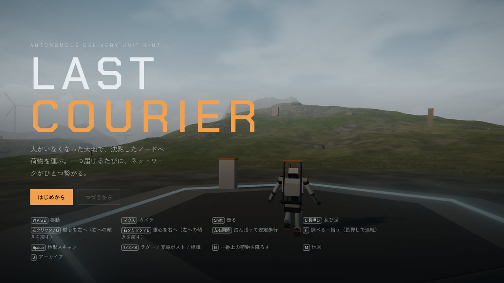
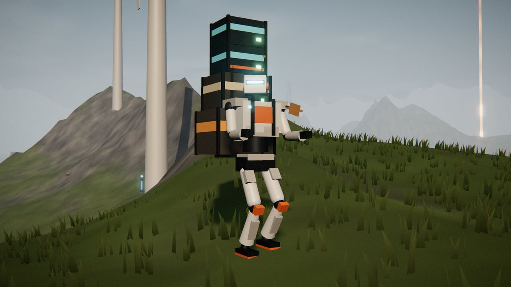
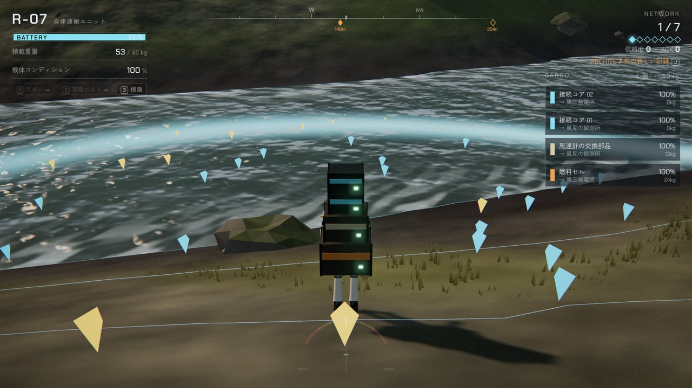
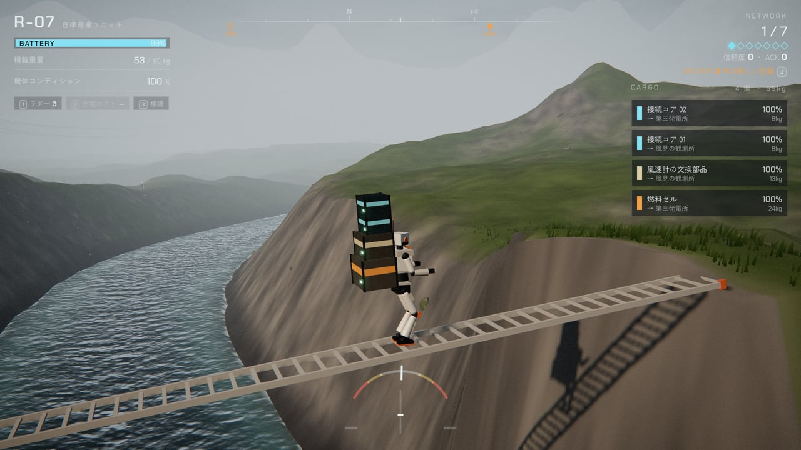
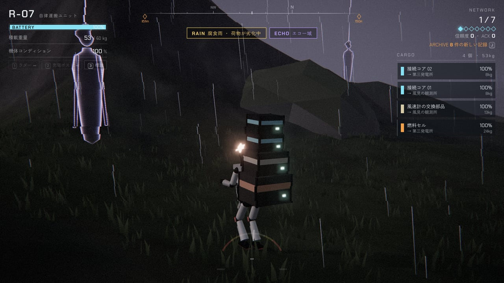
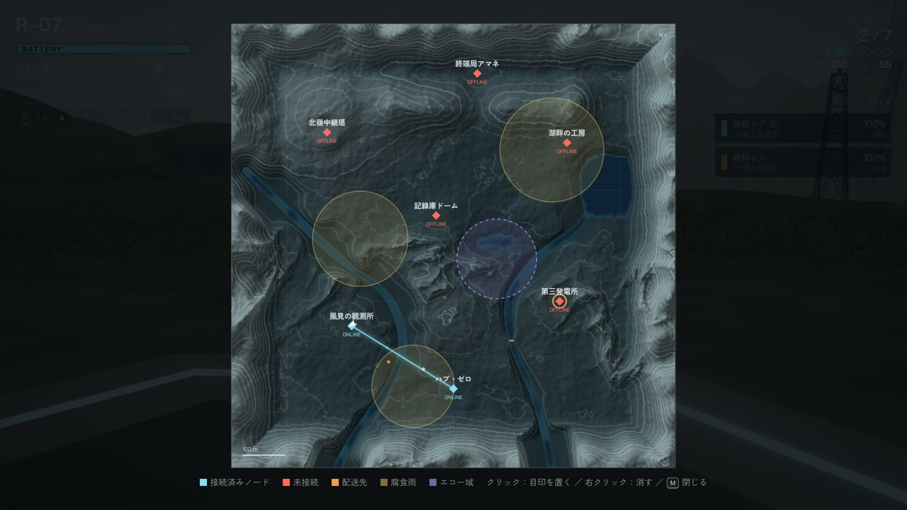
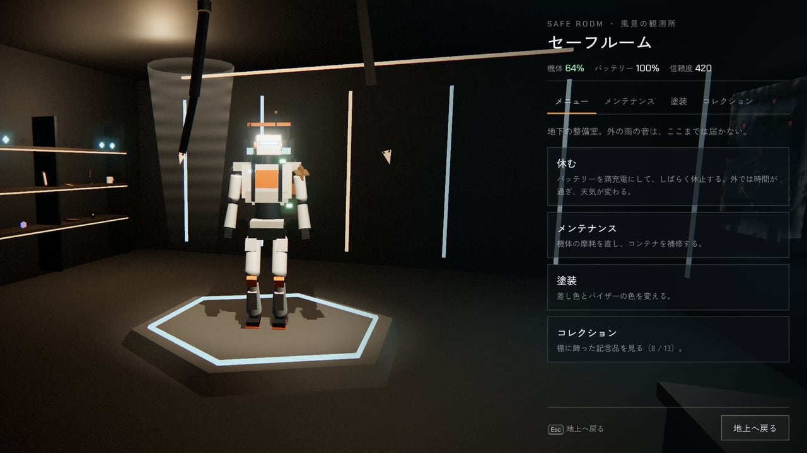
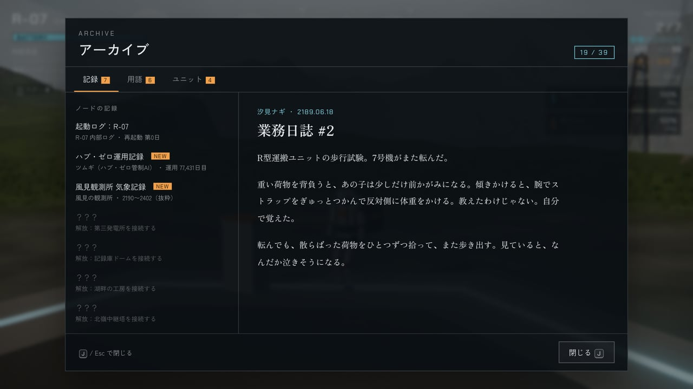

# LAST COURIER（ラスト・クーリエ）

人がいなくなった大地で、荷物を背負った配達ロボットが沈黙した拠点をつなぎ直す、ブラウザで遊べる 3D 配送ゲーム。

[](https://tanuu5.github.io/last-courier/)
[](https://www.anthropic.com/claude)
[](./LICENSE)

<p align="center">
  
</p>

<p align="center"><b><a href="https://tanuu5.github.io/last-courier/">▶ ブラウザで今すぐ遊ぶ</a></b>（PC 向け、インストール不要）</p>

**Claude Code × Claude Opus 5.5（XHIGH）** で作りました。

『DEATH STRANDING』に着想を得た、オリジナルの小さな配送ゲームです。
主人公は自律運搬ユニット R-07。背中に積み上がる荷物のバランスをとりながら、川や渓谷、エコーのさまよう雨の中を歩き、7つの拠点へ荷物を届けてネットワークを復旧させます。
地形、3D モデル、効果音、音楽まで、画像や音声の素材ファイルは使わず、すべてコードで生成しています。

## スクリーンショット

<table>
  <tr>
    <td width="50%"><br><sub>タイトル画面。人がいなくなった大地で、配達ユニット R-07 が再起動する。</sub></td>
    <td width="50%"><br><sub>主人公の R-07。荷物は背中のラックに積み上がり、高く重いほど揺れやすい。</sub></td>
  </tr>
  <tr>
    <td><br><sub>地形スキャン。青は安全、黄は注意、赤は危険。浅瀬を探して川を渡る。</sub></td>
    <td><br><sub>ラダーを架けて渓谷を渡る。傾いたら反対側に重心を移して立て直す。</sub></td>
  </tr>
  <tr>
    <td><br><sub>腐食雨のエコー域。スキャンで姿が見える「エコー」に気づかれないよう進む。</sub></td>
    <td><br><sub>地図。7つの拠点、つないだネットワーク、雨雲、エコー域が見える。</sub></td>
  </tr>
  <tr>
    <td><br><sub>拠点の地下のセーフルーム。休む、整備、塗装、コレクションの棚。</sub></td>
    <td><br><sub>アーカイブ。拠点の記録やデータ片から、この世界に何があったのかがわかっていく。</sub></td>
  </tr>
</table>

画像と動画は、すべて実際のゲーム画面です。

## 遊び方

拠点のターミナルで依頼を受け、荷物を宛先の拠点へ届けます。接続コアを届けた拠点はネットワークにつながり、次の依頼が開きます。アーカイブ（J / Y）の「配送記録」では、これまでの依頼の状態と評価、次のメイン依頼の受け取り場所や解放条件を確認できます。一時停止メニューの「道しるべ」を「あり」にすると、次の行き先を画面左上・コンパス・地図に常に表示します（サクサク進めたい人向け。初期設定は「なし」）。7つの拠点をすべてつなぐとエンディングです。

- **バランス**：荷物が重く、高く積むほど揺れやすくなります。右に傾いたら左クリック（Q）、左に傾いたら右クリック（E）で重心を反対側に移して立て直します。両方押すと、ゆっくりですが安定して歩けます。傾きすぎると転び、荷物が散らばります。
- **地形**：急な斜面は滑り落ち、深い川では足をとられます。スキャンで浅瀬やゆるい坂を探し、ラダーで川や段差を越えます。
- **腐食雨**：雨の中にいると、荷物のコンテナが少しずつ傷みます。
- **エコー**：エコー域には、近づくユニットに入り込もうとする「エコー」がいます。忍び足で進み、捕まったら連打で振りほどきます。
- **バッテリーと機体コンディション**：接続した拠点や充電ポストで回復。転倒などで摩耗した機体は、拠点の地下のセーフルームで整備します。どちらかが 0 になるとその場で停止し、回収ドローンで最後に立ち寄った拠点へ運ばれます（背中の荷物は少し傷み、落とした荷物はその場に残ります）。
- **評価**：荷物の状態と所要時間で S〜C の評価が付きます。設置したラダーなどには、ほかのユニットから ACK（いいね）が届きます。自分で置いたものは、近くで F（A）を長押しすると撤去でき、ラダーと充電キットは回収できます。
- **救済**：動けなくなったら、一時停止メニューの「拠点へ帰還」（進行はそのまま）か「拠点からやり直す」（最後に拠点を出た時点のセーブを読み込む）を使えます。
- 進行は拠点に立ち寄るたびにブラウザへ自動で保存されます（「つづきから」で再開）。

| 操作 | キーボード・マウス | ゲームパッド |
| --- | --- | --- |
| 移動 | W A S D | 左スティック |
| カメラ | マウス（画面をクリックで開始） | 右スティック |
| 走る | Shift | L3（切り替え） |
| 忍び足 | C 長押し | X（切り替え） |
| 重心を左へ（右への傾きを戻す） | 左クリック / Q | LT |
| 重心を右へ（左への傾きを戻す） | 右クリック / E | RT |
| 踏ん張って安定歩行 | 左右同時 | LT + RT |
| 調べる・拾う（長押しで連続） | F | A |
| 地形スキャン | Space | RB |
| ラダー / 充電ポスト / 標識 | 1 / 2 / 3 | 十字 ↑ / → / ↓ |
| 一番上の荷物を降ろす | G | 十字 ← |
| 設置物の長さ・種類 | ホイール | LB / RB |
| 自分の設置物を撤去・回収 | F 長押し | A 長押し |
| 地図 / アーカイブ | M / J | View / Y |
| 一時停止 | Esc | Menu |

ゲームパッドのボタン表示は、一時停止メニューの「ボタン表示」で、タイプA（A B X Y）とタイプB（× ○ □ △）を切り替えられます。初期設定の「自動」では、つないだコントローラーに合わせて選ばれます。上の表はタイプAの表記です（タイプBでは LB / RB → L1 / R1、LT / RT → L2 / R2、View / Menu → Create / Options）。

## 制作について

企画・ディレクション：**たぬ**　／　開発：**Claude Code（Claude Opus 5.5・推論レベル XHIGH）**

設計から実装、テストまで Claude Code が進めました。地形の生成、ロボットの歩行アニメーション（脚の逆運動学）、水・草・雨のシェーダー、効果音と音楽（Web Audio）、世界観の文章まで、すべてコードとテキストで作っています。
確認は、実 GPU のブラウザで画面を見ながら行いました。公開前には、経路探索で 6 本の配送ルートがすべて歩いて到達できることを確かめ、自動操縦のボットに新しいゲームからエンディングまで、実際の物理（バランス・転倒・川・エコー）のまま通しでプレイさせています。

## 更新履歴

- **2026-10-02**：バッテリーか機体コンディションが 0 になると、その場で停止して最後に立ち寄った拠点へ回収されるようにした（背中の荷物は 10% 傷む）。残り少なくなるとツムギが警告し、機体の損傷が大きいと HUD に表示。
- **2026-10-01**：セーフルームの棚でアイテムが仕切りを貫通していたのと、マグカップの持ち手の向きを修正。前回追加した行き先の案内を「道しるべ」オプション（初期設定は「なし」）に変更。アーカイブに「配送記録」を追加（依頼の状態と評価、メイン依頼の解放条件）。更新直後に古いファイルが混ざらないよう、読み込むファイルに版番号を付けた。
- **2026-10-01**：次のメイン依頼をどの拠点で受けられるかを、HUD・コンパス・地図に表示するようにした（拠点をつなぐたびにツムギも案内）。依頼の説明文に `{d}` と出ていたのを修正。他ユニットの橋が渓谷の谷底に置かれていたのを、崖の上どうしを結ぶ位置に修正（以前のセーブも読み込み時に置き直す）。まだ現れていない充電ポストに見えない当たり判定があったのを修正。
- **2026-09-30**：歩いたり走ったりしたままアーカイブ・地図・一時停止を開くと、裏でロボットがその場で足踏みを続けていたのを修正。ゲームパッドのボタン表示をタイプA / タイプBで切り替えられるようにした（自動判別つき）。
- **2026-09-30**：公開

## 開発

ビルドは不要です。静的なファイルをそのまま配信すれば動きます。

```bash
python3 -m http.server 8000   # http://localhost:8000/ を開く
```

`index.html` をダブルクリックして開いても遊べます（three.js とフォントを CDN から読み込むため、インターネット接続が必要です）。

```
index.html            画面の骨組み。three.js を読み込んだあと、js/ のスクリプトを順番に読み込む
css/style.css         HUD・メニューの見た目
js/
  core/ data/         共通の関数、ワールドの定義、アーカイブの文章（data/lore.js）
  world/ render/      地形の生成、描画（空・地形・水・草・岩・雨・ポストエフェクト）
  entities/           ロボット、荷物、拠点、設置物、エコーの 3D モデル
  game/               プレイヤー、バランス、荷物、依頼、ネットワーク、救済、セーブ
  ui/ input/ audio/   HUD・ターミナル・地図・アーカイブ、キーボード・マウス・ゲームパッド、音
  room/ main/         セーフルーム、カメラ・画面の流れ・メインループ
```

`js/` のファイルは ES モジュールではなく、1 つのグローバルスコープを共有する通常のスクリプトです（`index.html` に書いた順に読み込まれます）。ブラウザの開発者ツールでは `window.__LC` からゲームの内部状態を確認できます。

## GitHub Pages で公開する

リポジトリの Settings → Pages で、Source を「Deploy from a branch」、Branch を `main` / `/ (root)` にすると、`https://<ユーザー名>.github.io/last-courier/` で遊べるようになります。

## クレジット・ライセンス

- コード：MIT License（[LICENSE](LICENSE)）© 2026 たぬ
- 3D 描画：[three.js](https://threejs.org/) r170（MIT License、CDN から読み込み）
- フォント：Chakra Petch、Zen Kaku Gothic New、Zen Old Mincho（Google Fonts、SIL Open Font License、ページから読み込み）
- 画像・音声の素材ファイルは使っていません。地形・モデル・効果音・音楽はすべてコードで生成しています。
- 『DEATH STRANDING』に着想を得たオリジナル作品です。同作およびその権利者とは無関係の非公式作品で、その名称・キャラクター・楽曲・素材は使用していません。
- MIT License の対象はこのリポジトリのコードと文章です。「Claude」の名前や商標の使用を許諾するものではありません。
